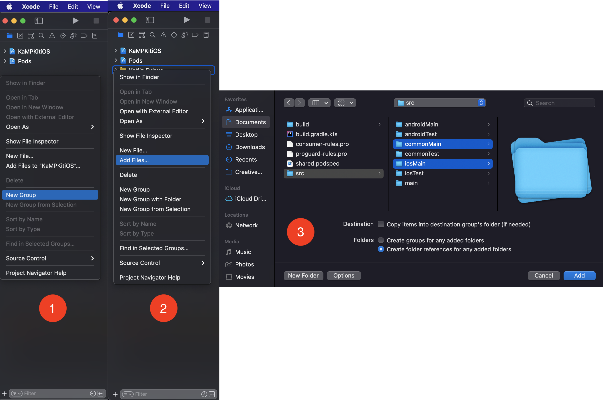

# Kotlin Native Xcode Support

Plugin to facilitate debugging iOS applications using Kotlin Native in Xcode. Defines Kotlin files as source code, with basic highlighting. Allows you to set breakpoints and includes llvm support to view data in the debug window. Xcode does not officially support custom language definitions, but they also don't explicitly block them.


> ## Touchlab's Hiring!
>
> We're looking for a Mobile Developer, with Android/Kotlin experience, who is eager to dive into Kotlin Multiplatform Mobile (KMM) development. Come join the remote-first team putting KMM in production. [More info here](https://go.touchlab.co/careers-gh).


## Installation

There are 2 parts to Kotlin support: 1) debugging support and 2) language color and style formatting.

You need to tell Xcode that `*.kt` files are source files, and run an lldb formatter script when debugging starts. Advanced users may want to do this manually, but generally you can just run the setup script:

```
./setup.sh
```

## Usage

If properly set up, you should be able to add Kotlin source to Xcode, set up breakpoints, and step through code. To add Kotlin source to Xcode, follow these steps:

1. Add a New Group to the Xcode project.
2. Add Files to the newly created group (Kotlin Debug in this instance).
3. Select the folders in the Kotlin library that are directly relevant to the iOS build, which will usually be `commonMain` and `iosMain`. Make sure "Copy items into destination group's folder (if needed)" is unchecked.



When you're done, your Xcode project structure should look something like this:


### Sample

The project used as an example above is [KaMPKit](https://github.com/touchlab/KaMPKit/). Check it out if you want to see a project that already includes Kotlin file references in Xcode. It's an excellent template for Kotlin multiplatform mobile projects.

### Sources

Setting up the Plugin has been an amalgam of various source projects, as Xcode "Plugins" are undocumented. The most significant piece, the language color file came from other color files shipped with Xcode. Xcode plugin file from [GraphQL](https://github.com/apollographql/xcode-graphql/blob/master/GraphQL.ideplugin/Contents/Resources/GraphQL.xcplugindata)

LLDB formatting originally comes from the Kotlin/Native project, source [konan_lldb.py](https://github.com/JetBrains/kotlin-native/blob/dbb162a4b523071f31913e888e212df344a1b61e/llvmDebugInfoC/src/scripts/konan_lldb.py), although the way data is grabbed has been heavily modified to better support an interactive debugger.

## Possible Future Stuff

Check out the [Discussions](https://github.com/touchlab/xcode-kotlin/discussions/).

## Xcode Updates

Every time Xcode is updated we need the UUID. It needs to be added to `Kotlin.ideplugin/Contents/Info.plist`. To find the 
UUID of your version of Xcode, run the following:

```
defaults read /Applications/Xcode.app/Contents/Info DVTPlugInCompatibilityUUID
```

Info [from here](https://www.mokacoding.com/blog/xcode-plugins-update/)
